# YazilimStaji
Yazılım yaz stajımda öğrendiklerim ve kendimi geliştirmek için yaptığım çalışmalar.

## Saga Pattern 

  
<strong>1. Saga pattern mikroservis mimarisinde hangi sorunları çözmeye çalışır?</strong>

   

  **Çözdüğü sorun:** Mikroservis mimarisinde her servisin kendi veri tabanı olduğu için veri tutarlılıklarını sağlamak zordur. Saga Pattern sayesinde isteklerin başarılı oldukça devam etmesi ve hata durumlarında geri alma aksiyonu ile veri tutarlılıkları sağlamak kolaylaşır.
  

---

  
<strong>2. Saga pattern'deki choreography ve orchestration yaklaşımları arasındaki temel fark nedir?</strong>

   
  
  **Saga pattern'deki Choreography yaklaşımı:** Yerel işlemlerin her biri, diğer hizmetlerdeki yerel işlemlerini tetikleyen domain(alan) olayı yayınlar. Kendi tamamlandıktan sonra diğer işlemin de başlamasını sağlar. Olay yayınlandıktan sonra diğer servisler dinler ve tetiklenirse işlem yapar. 

  **Saga pattern'deki Orchestration yaklaşımı:** Bir saga koordinatörü hangi servisin yerel işlemlerinin yürütüleceğini söyler. Komut tabanlı olup servislere komut gönderir ve servislerdeki komut işleyiciler bu komutu alarak işlemlerini yaparlar.

  **Karşılaştırma:** Choreography yaklaşımı dağıtık kontrollü olup event yayınlama ile iletişim sağlar. Orchestration yaklaşımı ise merkezi kontrollü olup komut gönderme ile iletişim sağlar.
  

---

  
<strong>3. Orchestration Saga pattern avantajları ve dezavantajları nelerdir?</strong>

   

  **Orchestration Saga pattern avantajları:** Bir servise komut gönderdikten sonra doğru bir sonuç geldiğinde diğer hizmete yeni komutu göndererek düzeni sağlar. Yanlış bir sonuç geldiğinde de eski servislerdeki geri alma komutlarını çalıştırarak yanlışlığı engeller.

  **Orchestration Saga pattern dezavantajları:** Çok adım gerektiğinde karmaşıklık meydana gelebilir. Her adımın sadece komutu işlemesi hariç telafi edici işlemleri de olduğu için tüm senaryoları düşünmek zordur ve çaba gerektirir. 
 

---

  
<strong>4.1. Bu süreci yönetmek için bir Saga pattern tasarlayın ve basit bir durum makinesi (state machine) diyagramı çizin. Sipariş Verildi aşamasından Sipariş Tamamlandı aşamasına kadar olan her bir durumu çizin ve her bir başarısızlık durumunda geri alma adımlarını gösterin.</strong>

   

  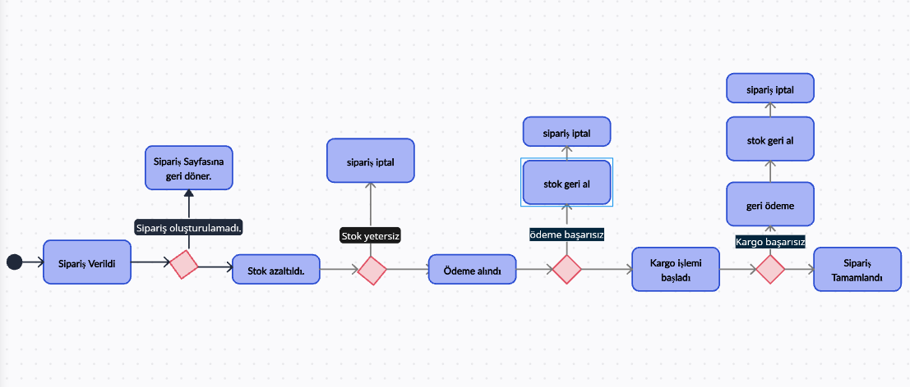
  
 

---

  
<strong>4.2. Her bir durumda, ilgili hizmetin başarılı ya da başarısız olması durumunda nasıl bir geçiş yapılacağını açıklayın.</strong>

   

  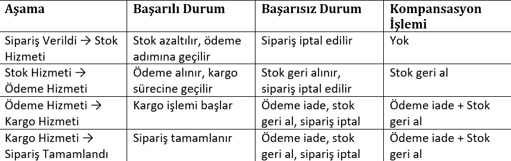
  
 

## Xunit ve Moq

  
<strong>1.	.NET platformunda unit test yapma sürecini açıklayın ve örnek olarak Xunit ve Moq kütüphanelerini kullanarak bir unit test yazın</strong>

    
  
  **Süreç:** NET platformunda unit test, uygulamanın en küçük birimlerini (fonksiyon, servis, repository vb.) izole biçimde test ederek doğruluğunu kontrol etme sürecidir. Bu süreçte amaç, yazılımın her bileşeninin tek başına doğru çalıştığını garanti altına almaktır.

  **Kullanılan Kütüphaneler:** xUnit ve Moq.

  **Test Yazma Adımları:** Arrange(Hazırlık işlemleri), Act(Test edilmek istenen fonksiyonun çağrılma işlemleri), Assert(Act aşamasındaki sonuçların beklenen değerlerle karşılaştırma işlemleri). Bu adımlarla test yazılmış olur. Parametreli olup olmadığına göre [Fact] ve [Theory] özelliği eklenir.
   
  
   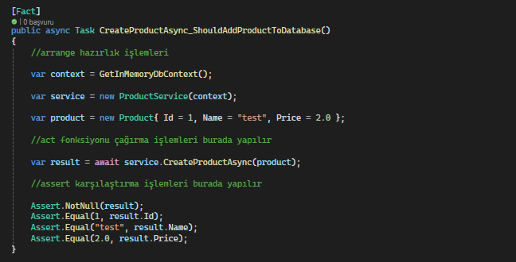
   

---

  
<strong>2. Xunit ve Moq Temel Kavramları.</strong>

   
  
  **Xunit:** Unit Test, bir yazılımın en küçük test edilebilir bölümlerinin(sınıflar,metodlar vs.), tek tek ve bağımsız olarak doğru çalışabilirliğinin incelendiği bir yazılım geliştirme sürecidir. Xunit ise popüler Unit Test Frameworklerinden biridir. 

  **Moq:** C# dilinde ve birim testlerinde yaygın olarak kullanılan bir mocking(taklit nesne oluşturma) kütüphanesidir. 
  

---

  
<strong>2.1. Bu kütüphanelerde sıkça kullanılan fonksiyonları ve kavramları açıklayın.</strong>

   
  
  **Service Under Test (Sut):**  Unit test metodlarını yazarken test edilecek sınıf ya da servisin ismini belirtmede yada değişken ismi tanımlarken kullanılır.

  **Mocking:** Sut içerisinde bulunan business’a ait testleri yazarken içerisinde kullanılan nesnelere ait fake sınıflardır. Mock öncelikle birim testlerinde kullanılır. Test edilen bir nesnenin diğer (karmaşık) nesnelere bağımlılıkları olabilir. Orjinal nesnenin davranışını yalıtmak için, onun yerine , gerçek nesnelerin davranışını taklit eden sahte nesnelerle değiştirmek gerekir. Kısacası, mocking etmek gerçek nesnelerin davranışını simüle eden nesneler yaratmaktır.

  **Arrange:** Testin başında gerekli ortam hazırlanır. Mock nesneleri, sut vs.

  **Act:** Test etmek istediğin metod çağrılır. Amaç davranışı tetiklemektir.
  
  **Expected:** Unit test yazdığımız metodun veya fonksiyonun return etmesi beklenen çıktısına denir.

  **Actual:** Unit test’ini yazdığımız metot ya da sınıfın gerçek, o an return ettiği result’ı tanımlarken kullanılır.

  **Assertion:** Actual ve expected dönüş değerlerinin karşılaştırılacağı, içerisinde tanımlamalar yapabildiğimiz yapının/metodun/sınıfın ismidir.

  **[Fact]:** Özniteliktir, yazmış olduğumuz metodun test çalıştırıcısı tarafından yürütülmesi gerektiğini belirtir.

  **[Teori]:** Özelliktir, test metoduna parametreler göndereceğimizi belirtir.

  **[InlineData]:** özniteliktir, test yöntemine gönderdiğimiz parametreleri ifade eder. Parametre sayısı kadar InlineData bulunur. [Teori] özelliğini kullanılıyorsa, [InlineData] öğesi de kullanılmak zorundadır.

  

---

  
<strong>2.2. Mocked object üretme: Testlerde bağımlılıkları izole etmek için nesneleri nasıl "mock"layabiliriz?</strong>

   
  
  .NET testlerinde dış bağımlılıkları (veritabanı, API, servisler, mapper vb.) izole etmek için Moq kütüphanesi kullanılır. Bu sayede test edilen sınıf sadece kendi iç mantığına odaklanır ve dış dünyaya olan bağımlılıkları sahte (mock) nesnelerle değiştirilir.
   
  
  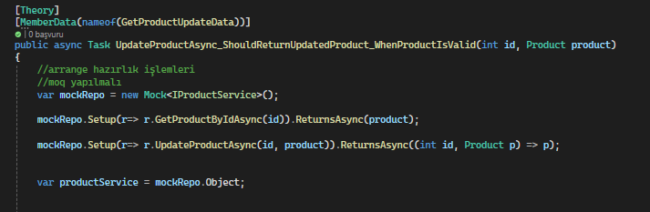

  Yukarıdaki yapı sayesinde: Gerçek bir veritabanı bağlantısı kurulmadan test yapılabilir.
  
   
  Verify() metodu ile gerçekten çağrılıp çağrılmadığı test edilebilir:
  
  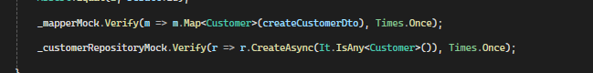

  

---

  
<strong>2.3. Assert işlemleri: Beklenen ve gerçek değerleri doğrulama yöntemleri.</strong>

   
  
  Assert işlemleri, test edilen fonksiyonun gerçekten beklenen sonucu üretip üretmediğini kontrol etmek için kullanılır. xUnit kütüphanesi bu doğrulamalar için birçok yerleşik Assert metodu sağlar.
  Testlerdeki ana amaç; verilen bir girdiyle, beklenen çıktının elde edilip edilmediğini kontrol etmektir.
   

  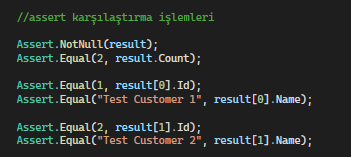
  
  

   
  Bu kontroller sayesinde hem dönüş değerleri hem de arka planda hangi fonksiyonların çağrıldığı net olarak doğrulanmış olur.
  Assert işlemleri sayesinde testler fail olduğunda, hangi kısmın bozulduğu kolayca anlaşılır.
  Geliştirilen metodun mantıksal hatalarını erken aşamada tespit etmemizi sağlar.
  İleride kodda bir değişiklik yapıldığında, bu testler sayesinde geriye dönük bozulmalar (regression) kolayca yakalanır.

---

  
<strong>2.4. Fact ve Theory: Farklı test senaryoları için Fact ve Theory kullanımını kod üzerinde uygulayalım.</strong>

   
  
  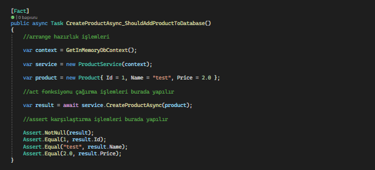
  
  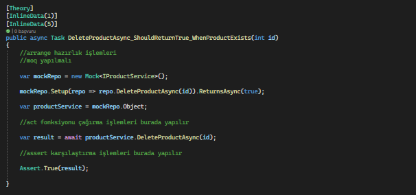

  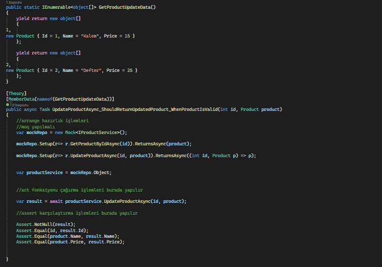
  

---

  
<strong>3.1. Repository sınıfları için bir CRUD yapısı kurarak testler yazın. Bu süreçte Entity Framework Core kullanarak basit bir CRUD işlemi hazırlayın.</strong>

   

  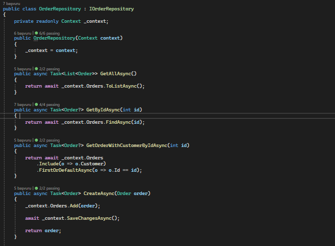

  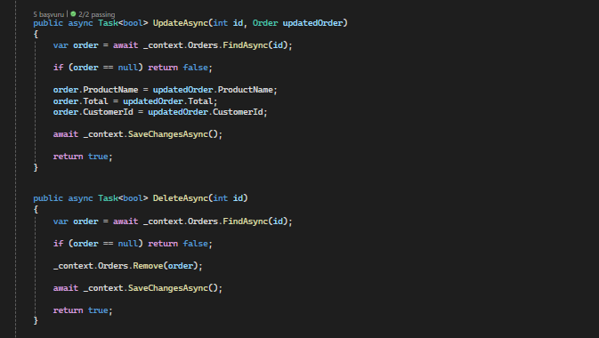

  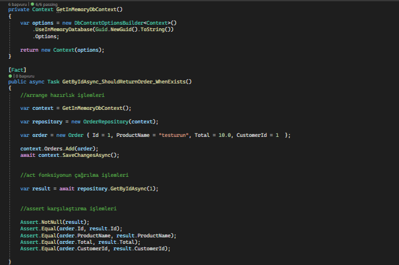

  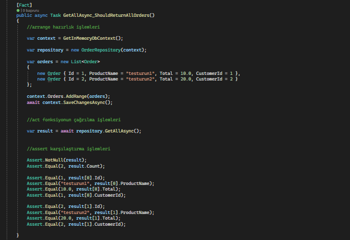

  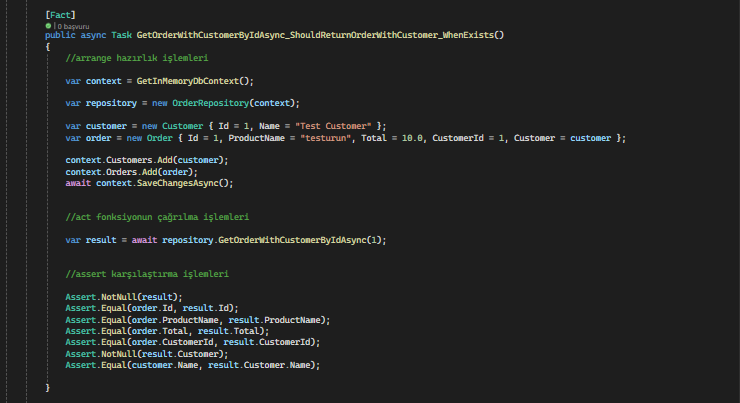

  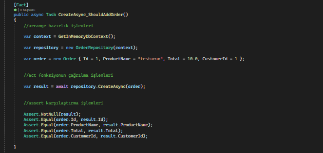

  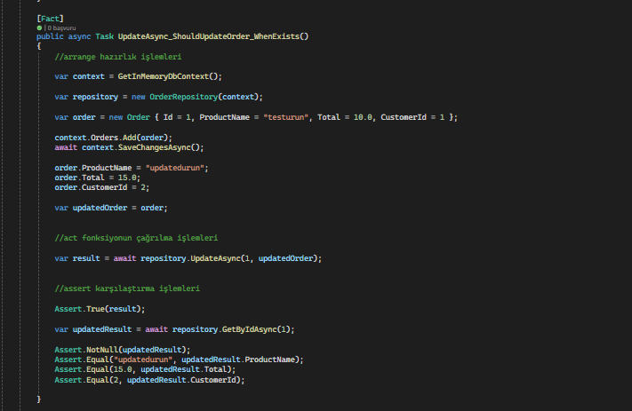
  
  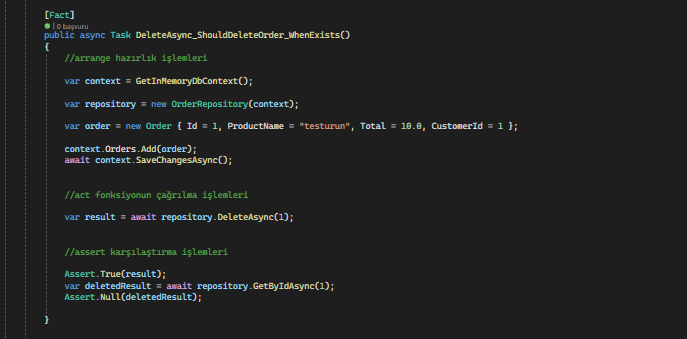
  

---

  
<strong>3.2. Mapper’ı ve veritabanını mocklama işlemlerini nasıl yapacağınızı gösterin.</strong>

   
  
  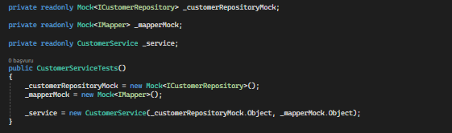

  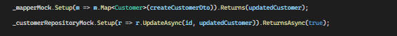

  

  

---

  
<strong>3.3. Yerel bir veritabanı (MSSQL) kullanarak Visual Studio 2022'nin SQL Object Explorer'ı üzerinden bağlantı kurarak CRUD işlemlerini gerçekleştirin.</strong>

   

## Application Monitoring - Event Sourcing - CQRS

  
<strong>1. Application Monitoring nedir? Elastic search nedir?</strong>

   

  ***Application Performance Monitoring(Uygulama Performans İzleme):*** Bir uygulamanın düzgün çalıştığından emin olmak için performansını, kullanılabilirliğini ve son kullanıcı deneyimini izleme sürecidir. APM, tatmin edici bir kullanıcı deneyimi sunmak ve müşteri hizmetleri sorunlarını veya şikayetlerini önlemek için hayati önem taşır. 

  Ağ üzerindeki veri iletimlerinin gerçek zamanlı G/Ç paket taramasına dayanır. Verilerin analiz edilmesi ve ilişkilendirilmesi, performans sorunlarını tespit etmeyi ve teşhis etmeyi mümkün kılar.

  ***Elastic Search:*** Büyük miktarda gerçek zamanlı veriyi toplayabilen, işleyebilen, depolayabilen, analiz edebilen ve görselleştirebilen açık kaynaklı bir arama ve analiz motorudur.

  Elastic Stack, Logstash, Elasticsearch ve Kibana'dan oluşur. Logstash, tüm ham verileri toplayıp, indeksleyip Elasticsearch'te depolamadan önce işlemekten sorumludur. İndeksleme işleminden sonra, veriler üzerinde karmaşık sorgular çalıştırabilir ve verilerin karmaşık özetlerini almak için toplamaları kullanabiliriz.
  

---

  
<strong>2. Event Sourcing Nedir?: Microservice mimarisinde Event Sourcing nedir, ne zaman kullanılır, avantajları ve zorlukları nelerdir?</strong>

   

  ***Event Sourcing(Olay Tabanlı Mimari):*** Sistemdeki tüm durum değişikliklerini(olayları) kaydetmeyi ve bu olaylardan sistemin durumunu oluşturmayı amaçlayan bir tasarım desenidir. 

  ***Microservice mimarisinde Event Sourcing:*** Event Sourcing, sistemde gerçekleşen her işlemin (örneğin bir siparişin oluşturulması, ödemesinin yapılması, iptal edilmesi gibi) bir "event" (olay) olarak kaydedilmesidir. Bu event'ler değiştirilemez ve zamana göre sıralanır. Veritabanında sadece event'ler tutulur, sistemin son durumu bu event'lerin replay edilmesiyle hesaplanır.

  ***Ne zaman kullanılır?:*** Karmaşık iş süreçlerinin ve domain mantığının bulunduğu durumlarda, sistem durumlarının geçmişini detaylı olarak izlemek gerektiğinde, Event-Driven(Olay Odaklı) sistemler kurmak istendiğinde Event Sourcing kullanılır.

  ***Avantajları:*** Geçmişteki olayları takip edebilme, Replay(olaylar yeniden replay edilerek sistemin geçmişteki bir hali tekrar oluşturulabilir.), performans vb. .

  ***Dezavantajları:*** Komplekslik, event yapıları değişebilir sürekli yenilenmeli, eventler değiştirilemez olduğundan kişisel verilerin silinmesi zor, kullanımı zor. 
   

---

  
<strong>3. CQRS (Command Query Responsibility Segregation) Nedir?: CQRS ile Event Sourcing'in ilişkisi, kullanımı ve getirisi hakkında bilgi verin.
</strong>

   

  ***CQRS Nedir?:*** Okuma ve yazma işlemlerinin farklı modellere ayrılmasını amaçlayan tasarım desenidir. Command yazma işlemleri için, Query ise okuma işlemleri için farklı veri modellerini kullanır. 

  ***CQRS - Event Sourcing ilişkisi:*** CQRS ile Event Sourcing birbirinden bağımsız kavramlar olsalar da birlikte kullanıldıklarında güçlü bir mimaridir. 

  ***CQRS - Event Sourcing kullanımı:*** Command bir işlem olduğunda event üretir. Event Handler bu eventi işler ve başka servisleri tetikler. Query okuma tarafına gidecek veriyi uygun bir modele günceller. (Örnek bir senaryo) DDD, Mikroservisler, Finansal uygulamalar vb. .

  ***CQRS - Event Sourcing Getirisi:*** Mimari olarak sistemin esnekliğini, ölçeklenebilirliğini ve izlenebilirliğini ciddi şekilde artırır. Örnek: DDD ile uyum, iş sürecini ve senaryoyu izleme, test edilebilirlik, bağımsız geliştirme vb. .
  

## API Gateway ve BFF (Backend For Frontend)

  
<strong>1. Microservice’lerde API Gateway kullanımı. Avantajları, hangi durumlarda kullanılması gerektiği ve farklı API Gateway araçları hakkında bilgi verin (Kong, Zuul, Ocelot, vs.).</strong>

   

  ***API Gateway:*** Gateway, Client tarafından servislerimize gelen istekleri karşılayan yapılar olarak nitelendirilir. API Gateway Client tarafından istekleri alıp servislere iletir. Bu sayede Client tarafından servisler için herhangi bir port bilgisinin bilinmesine gerek kalmaz. Client ve Gateway arasında sıkı bir bağımlılık vardır.

  ***API Gateway Avantajları:*** Gelen isteklerin izlenmesi analiz edilmesi, API'leri güvenli bir şekilde yönetebilmek, servislere gelen istekleri mikroservisler arasında eşit şekilde dağıtarak yükü dengeleyebilir, sık kullanılan istekleri önbelleğe alarak performansı arttırabilir.

  ***API Gateway Dezavantajları:*** Gateway servislerin merkezi konumunda olduğu için Gateway'de çıkan bir sorun tüm sistemi etkileyebilir. Sistem yönetimini karmaşıklaştırabilir ve iş yükünü arttırabilir. Ölçeklenebilirlik açısından zorluklar yaratabilir. Yüksek trafikli uygulamalarda API Gateway performansı sorun olabilir.

  ***Hangi durumlarda kullanılması gerekir?:*** Mikroservis mimarisi kullanıldığında, farklı istemciler için tek noktadan yönetim istenildiğinde, istek yönlendirme gerektiğinde, protokol dönüşümü gerektiğinde, isteklerin tek noktadan loglanması ve izlenilmesi istenildiğinde, güvenlik ve kimlik doğrulama mekanizmalarının merkezi yönetimi için vb. .

  ***Farklı API Gateway araçları:***

  -**Kong:** Açık kaynaklıdır, Yüksek performanslıdır, NGINX tabanlıdır, Plugin mimarisi ile özelleştirilebilir, JWT,rate limiting gibi özelliklere sahiptir. Uygulamadan özel sunucuya istek yönlendirmesini kontrol etmenizi, ayarlamanızı ve yönlendirmenizi sağlayan basit, hızlı ve hafif bir çözümdür.

  -**Zuul:** Netflix'in Java tabanlı API ağ geçididir, ek olarak Zuul her istek için bir dizi filtre işletir, bu filtreler çalışma anında belirlenir ve "İstek Bağlamı" aracılığıyla bilgi iletir. 

  -**Ocelot:** .NET Core platformunda kullanılır. Ocelot, API Gateway olarak çalışırken esnek ve modüler bir yapı sunarak farklı servisler arasındaki iletişimi kolaylaştırır. Çalışma prensibi, gelen istekleri belirli yönlendirmelere göre işleyerek, önceden tanımlanmış yönlendirmeler doğrultusunda ilgili servislere iletmek üzerine kuruludur. Bu kütüphane, bir dizi özelliği içinde barındırarak istemcilerden gelen istekleri alır, yönlendirir, filtreler ve servisler arasında iletişimi sağlar. ocelot.json dosyasına yazılan yönlendirme kurallarına göre ilgili servislere iletir.

  -**Trafeik:** Modern, bulut tabanlı bir HTTP ters proxy ve yük dengeleyicidir. Mikro hizmetler için güçlü destek sağlar ve Docker, Kubernetes, Rancher ve Consul ile entegre olur. Traefik, minimum yapılandırma gerektirir ve rotaları arka uç hizmetlerine enjekte etmek için otomatik hizmet keşfini kullanır.

  -**Tyk:** 2014'ten beri Tyk Technologie tarafından Go'da geliştirilen bir Açık Kaynak API Ağ Geçidi'dir. Gravitee'nin çalışması için üç işleme ihtiyaç vardır, 1.si ağ geçidi 2.si gösterge paneli 3.sü Redis'ten veri çeken ve MongoDB'ye enjekte eden pompadır. Kurulumu Kong'dan daha uzun sürüyor çünkü bir Redis ve bir MongoDB kurmanız gerekiyor. 

  -**HAProxy:** Lua ve C dillerinde yazılmış ücretsiz ve açık kaynaklı bir çözümdür. HAProxy, bir API Ağ Geçidi yerine bir yük dengeleyici olarak tasarlanmış olmasıyla önceki çözümlerden farklıdır , ancak API Ağ Geçidi olarak da kullanılabilir.  Mimarisi basittir, başlatılacak tek bir işlem vardır ve bu işlem başlatıldığında bir yapılandırma dosyasını okur.
  
  ...
   

---

  
<strong>2. Frontend ve Backend arasındaki ilişkilerde BFF tasarımı. Kullanıcı arayüzüne özgü servislerin nasıl sunulacağını açıklayın.</strong>

   

  

## Domain-Driven Design (DDD)

  
<strong>1. Aggregate, Entity, Value Object, Bounded Context, Repository gibi temel DDD kavramlarını açıklayın.</strong>

   

  ***Aggregate:*** İlgili olayları bir araya getiren ve bir bütün olarak ele alınan bir yapıdır. Tek bir işlem birimi, bir varlık veya bir nesne olarak düşünülebilir. Örnek e-ticaret uygulamasında her bir sipariş, bir Aggregate'dir.

  ***Entity:*** Kendine ait unique bir kimliği olan nesneler Entity olarak adlandırılır. DDD iş mantığını servislere değil, entitylere verir.

  ***Value Object:*** Entity'nin tam tersi olarak kendine ait unique bir kimliği olmayan nesneler Value Object olarak adlandırılır.

  ***Bounded Context:*** Domainde yer alan iş kuralları çerçevesinde mantıksal açıdan birbirleri ile en alakalı olanların bir araya gelerek gruplaştığı ve bu grubun sorumluluklarının net bir şekilde belirlenmiş olduğu yapılara Bounded Context denir.

  ***Aggregate Root(AR):*** Yapı içerisindeki diğer Entity'lerin koordinasyonunun sağlayacak yönetici Entity seçilir ve bu seçim AR'u işaret eder. AR diğer AR'nin Entity'si ile iletişime geçemez. Sadece AR'ler birbiri ile iletişim kurmalıdır.
  
  ***Repository:*** Bir Aggregate içerisindeki bütün Entity ve Value Object'lerin taşıdığı bilgilerin veritabanına yazılması amacı ile kullanılan kavramdır. Her bir AR için Repository oluşturulur.

  ***Layered Architecture:*** Domain Layer, Application Layer, Presentation Layer, Infrastructure Layer.

  

---

  
<strong>2. Domain-Driven Design’i, microservice mimarisiyle nasıl birleştirebileceğinizi anlatın. Bir domain model oluşturun ve bu modeli servisler arasında nasıl paylaşacağınızı açıklayın.</strong>

   

  

---

  
<strong>3.  DDD ile CQRS ve Event Sourcing’i nasıl entegre edebileceğinizi açıklayın.</strong>

   

  

