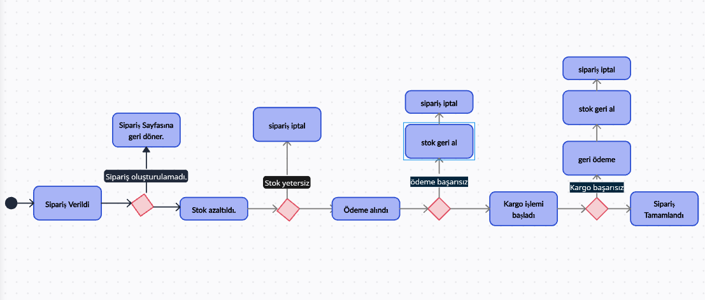
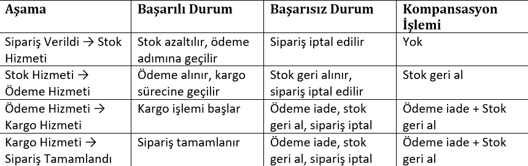
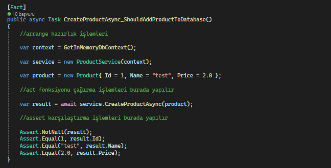

# YazilimStaji
Yazılım yaz stajımda öğrendiklerim ve kendimi geliştirmek için yaptığım çalışmalar.

# Saga Pattern

  
<strong>1. Saga pattern mikroservis mimarisinde hangi sorunları çözmeye çalışır?</strong>

   

  **Çözdüğü sorun:** Mikroservis mimarisinde her servisin kendi veri tabanı olduğu için veri tutarlılıklarını sağlamak zordur. Saga Pattern sayesinde isteklerin başarılı oldukça devam etmesi ve hata durumlarında geri alma aksiyonu ile veri tutarlılıkları sağlamak kolaylaşır.
  

---

  
<strong>2. Saga pattern'deki choreography ve orchestration yaklaşımları arasındaki temel fark nedir?</strong>

   
  
  **Saga pattern'deki Choreography yaklaşımı:** Yerel işlemlerin her biri, diğer hizmetlerdeki yerel işlemlerini tetikleyen domain(alan) olayı yayınlar. Kendi tamamlandıktan sonra diğer işlemin de başlamasını sağlar. Olay yayınlandıktan sonra diğer servisler dinler ve tetiklenirse işlem yapar. 

  **Saga pattern'deki Orchestration yaklaşımı:** Bir saga koordinatörü hangi servisin yerel işlemlerinin yürütüleceğini söyler. Komut tabanlı olup servislere komut gönderir ve servislerdeki komut işleyiciler bu komutu alarak işlemlerini yaparlar.

  **Karşılaştırma:** Choreography yaklaşımı dağıtık kontrollü olup event yayınlama ile iletişim sağlar. Orchestration yaklaşımı ise merkezi kontrollü olup komut gönderme ile iletişim sağlar.
  

---

  
<strong>3. Orchestration Saga pattern avantajları ve dezavantajları nelerdir?</strong>

   

  **Orchestration Saga pattern avantajları:** Bir servise komut gönderdikten sonra doğru bir sonuç geldiğinde diğer hizmete yeni komutu göndererek düzeni sağlar. Yanlış bir sonuç geldiğinde de eski servislerdeki geri alma komutlarını çalıştırarak yanlışlığı engeller.

  **Orchestration Saga pattern dezavantajları:** Çok adım gerektiğinde karmaşıklık meydana gelebilir. Her adımın sadece komutu işlemesi hariç telafi edici işlemleri de olduğu için tüm senaryoları düşünmek zordur ve çaba gerektirir. 
 

---

  
<strong>4.1. Bu süreci yönetmek için bir Saga pattern tasarlayın ve basit bir durum makinesi (state machine) diyagramı çizin. Sipariş Verildi aşamasından Sipariş Tamamlandı aşamasına kadar olan her bir durumu çizin ve her bir başarısızlık durumunda geri alma adımlarını gösterin.</strong>

   

  
  
 

---

  
<strong>4.2. Her bir durumda, ilgili hizmetin başarılı ya da başarısız olması durumunda nasıl bir geçiş yapılacağını açıklayın.</strong>

   

  
  
 

# Xunit ve Moq

  
<strong>1.	.NET platformunda unit test yapma sürecini açıklayın ve örnek olarak Xunit ve Moq kütüphanelerini kullanarak bir unit test yazın</strong>

    
  
  **Süreç:** NET platformunda unit test, uygulamanın en küçük birimlerini (fonksiyon, servis, repository vb.) izole biçimde test ederek doğruluğunu kontrol etme sürecidir. Bu süreçte amaç, yazılımın her bileşeninin tek başına doğru çalıştığını garanti altına almaktır.

  **Kullanılan Kütüphaneler:** xUnit ve Moq.

  **Test Yazma Adımları:** Arrange(Hazırlık işlemleri), Act(Test edilmek istenen fonksiyonun çağrılma işlemleri), Assert(Act aşamasındaki sonuçların beklenen değerlerle karşılaştırma işlemleri). Bu adımlarla test yazılmış olur. Parametreli olup olmadığına göre [Fact] ve [Theory] özelliği eklenir.

   
   

---

  
<strong>2. Xunit ve Moq Temel Kavramları.</strong>

   
  
  **Xunit:** Unit Test, bir yazılımın en küçük test edilebilir bölümlerinin(sınıflar,metodlar vs.), tek tek ve bağımsız olarak doğru çalışabilirliğinin incelendiği bir yazılım geliştirme sürecidir. Xunit ise popüler Unit Test Frameworklerinden biridir. 

  **Moq:** C# dilinde ve birim testlerinde yaygın olarak kullanılan bir mocking(taklit nesne oluşturma) kütüphanesidir. 
  

---

  
<strong>2.1. Bu kütüphanelerde sıkça kullanılan fonksiyonları ve kavramları açıklayın.</strong>

   
  
  **Service Under Test (Sut):**  Unit test metodlarını yazarken test edilecek sınıf ya da servisin ismini belirtmede yada değişken ismi tanımlarken kullanılır.

  **Mocking:** Sut içerisinde bulunan business’a ait testleri yazarken içerisinde kullanılan nesnelere ait fake sınıflardır. Mock öncelikle birim testlerinde kullanılır. Test edilen bir nesnenin diğer (karmaşık) nesnelere bağımlılıkları olabilir. Orjinal nesnenin davranışını yalıtmak için, onun yerine , gerçek nesnelerin davranışını taklit eden sahte nesnelerle değiştirmek gerekir. Kısacası, mocking etmek gerçek nesnelerin davranışını simüle eden nesneler yaratmaktır.

  **Arrange:** Testin başında gerekli ortam hazırlanır. Mock nesneleri, sut vs.

  **Act:** Test etmek istediğin metod çağrılır. Amaç davranışı tetiklemektir.
  
  **Expected:** Unit test yazdığımız metodun veya fonksiyonun return etmesi beklenen çıktısına denir.

  **Actual:** Unit test’ini yazdığımız metot ya da sınıfın gerçek, o an return ettiği result’ı tanımlarken kullanılır.

  **Assertion:** Actual ve expected dönüş değerlerinin karşılaştırılacağı, içerisinde tanımlamalar yapabildiğimiz yapının/metodun/sınıfın ismidir.

  **[Fact]:** Özniteliktir, yazmış olduğumuz metodun test çalıştırıcısı tarafından yürütülmesi gerektiğini belirtir.

  **[Teori]:** Özelliktir, test metoduna parametreler göndereceğimizi belirtir.

  **[InlineData]:** özniteliktir, test yöntemine gönderdiğimiz parametreleri ifade eder. Parametre sayısı kadar InlineData bulunur. [Teori] özelliğini kullanılıyorsa, [InlineData] öğesi de kullanılmak zorundadır.

  

---

  
<strong>2.2. Mocked object üretme: Testlerde bağımlılıkları izole etmek için nesneleri nasıl "mock"layabiliriz?</strong>

   
  

  

---

  
<strong>2.3. Assert işlemleri: Beklenen ve gerçek değerleri doğrulama yöntemleri.</strong>

   
  

  

---

  
<strong>2.4. Fact ve Theory: Farklı test senaryoları için Fact ve Theory kullanımını kod üzerinde uygulayalım.</strong>

   
  

  

